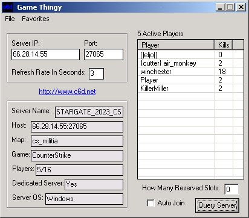



## Counter Strike Or Half Life Auto Joiner

### Description

This little application will query any half life or counter strike server or problably any mod of half life. It gives you information about the server and allows you to auto join the server when an available slot becomes available. It also has the option of accounting for reserved slots on a server. And it has a neat little favorites list too to store your favorite servers for easy joining.
 
### More Info
 
You have to input a server IP or host and the port that the server is using.

The server information along with the player names and frags.

None that I know of.

             |
---                |---
**Submitted On**   |2002-09-10 00:28:14
**By**             |[Dave Stringer](https://github.com/Planet-Source-Code/PSCIndex/blob/master/ByAuthor/dave-stringer.md)
**Level**          |Intermediate
**User Rating**    |4.8 (19 globes from 4 users)
**Compatibility**  |VB 6\.0
**Category**       |[Complete Applications](https://github.com/Planet-Source-Code/PSCIndex/blob/master/ByCategory/complete-applications__1-27.md)
**World**          |[Visual Basic](https://github.com/Planet-Source-Code/PSCIndex/blob/master/ByWorld/visual-basic.md)
**Archive File**   |[Counter\_St1291589102002\.zip](https://github.com/Planet-Source-Code/dave-stringer-counter-strike-or-half-life-auto-joiner__1-38822/archive/master.zip)

